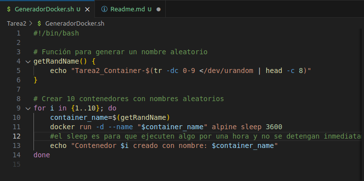
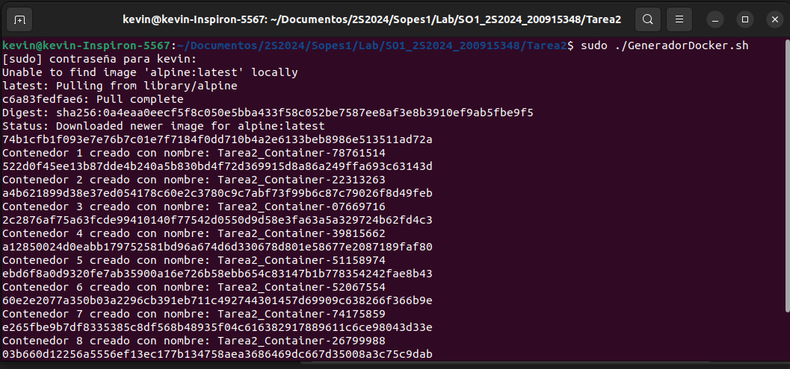
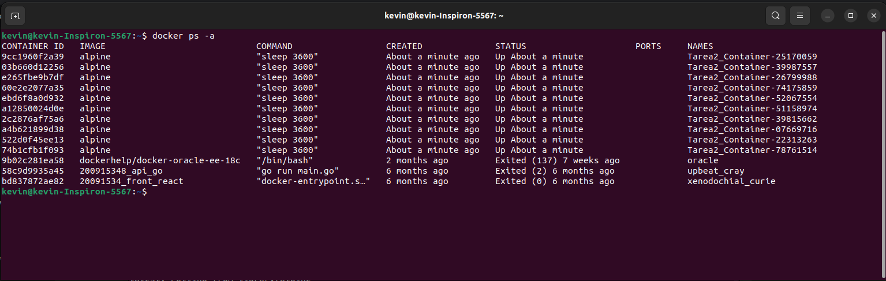

|              |                |
|    :---      |      ---:      |
| Nombre: Kevin Martin Samayoa Urizar | Curso: Laboratorio Sistemas Operativos 1 |
| Carnet: 200915348                   | Fecha: 17/08/2024            |
|              |                |

# TAREA 2

## Capturas

Script generador de 10 contenedores con nombres aleatorios

Ejecucion del script descargando la imagen base y creando 10 contenedores con nombres aleatorios

Lista de contenedores generados

